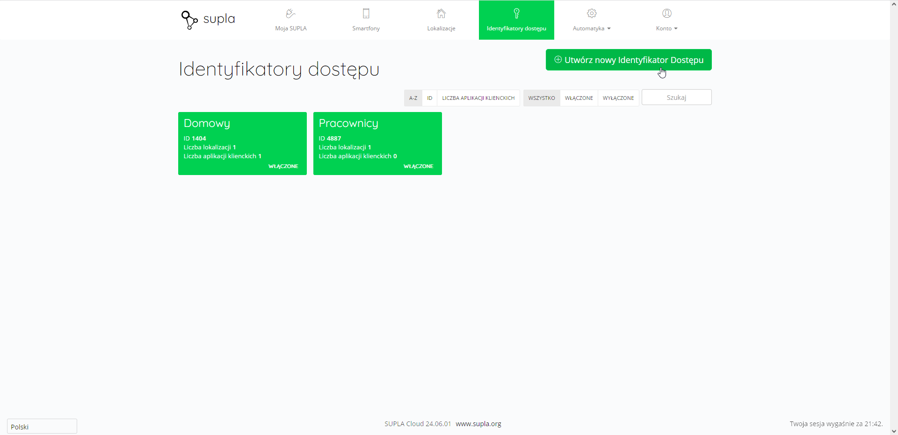
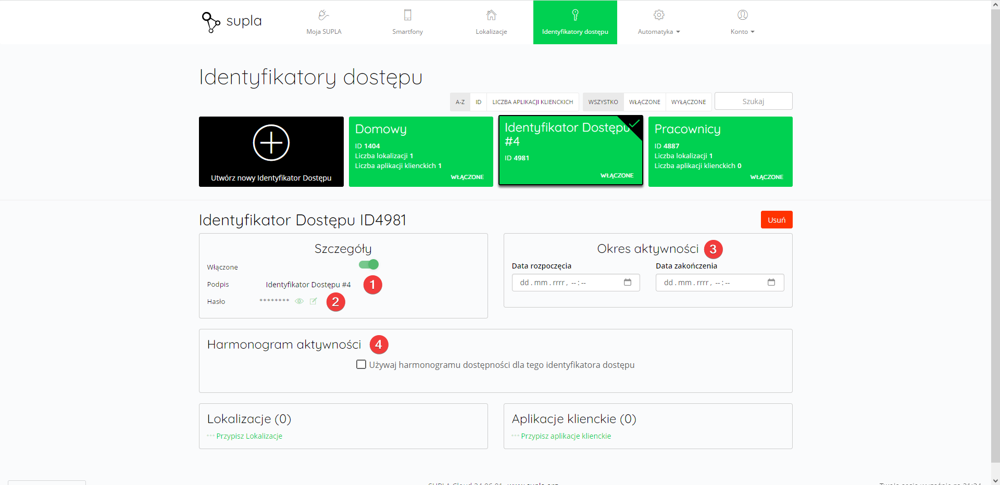

Identyfikatory dostępu służą do zarządzania dostępem do kanałów przez urządzenia mobilne z aplikacją SUPLA. Dzięki nim można ograniczyć dostęp do wybranych lokalizacji i ustawić godziny, w których użytkownik może sterować kanałami przypisanymi do odpowiedniej lokalizacji. Dodatkowo umożliwiają podział wysyłanych powiadomień pomiędzy wybrane identyfikatory.

Nowy Identyfikator dostępu można utworzyć klikając przycisk `Utwórz nowy Identyfikator dostępu` znajdujący się w prawym górnym rogu. Do identyfikatora można przypisać wybrane lokalizacje i aplikacje klienckie (wybrana aplikacja może być powiązana z maksymalnie jednym identyfikatorem).

Do dostosowania są następujące opcje:
1. **Podpis** - nazwa, która wyświetla się na liście identyfikatorów
2. **Hasło** - potrzebne przy rejestracji aplikacji mobilnej SUPLA za pomocą identyfikatora (`Zaawansowane` -> `Identyfikator`)
3. **Okres aktywności** - zakres czasu, w którym identyfikator będzie obowiązywał. Po przekroczenia daty zakończenia, identyfikator zmienia swój stan na wyłączony
4. **Harmonogram aktywności** - grafik określający zakres dni tygodnia i godzin, w których identyfikator jest aktywny.

