W sekcji aplikacje przedstawione są aplkacje, które są natywnie wyposażone w możliwość integracji z Suplą. Instrukcje dotyczące integracji poszczgólnych z nich znajdziesz poniżej.

> [!WARNING]
> Jeśli chcesz stworzyć własną integrację, [poczytaj więcej o API](/cloud/moje-konto#integracje).

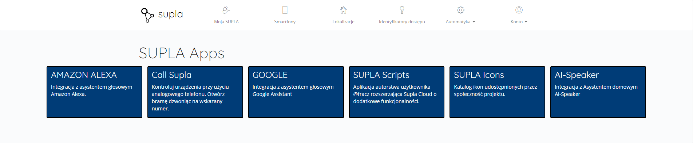

## Call Supla
Serwis [call.supla.io](https://call.supla.io) umożliwia wykonananie wybranych akcji na kanałach poprzez wykonanie połączenia na zdefiniowany numer. Aby połączyć konto Supla z call.supla.io należy:
1. Wejść na stronę call.supla.io i kliknąć przycisk `Zaloguj z SUPLA`
2. Zalogować się na konto Supla
3. Zezwolić aplikacji na dostęp do określonych uprawnień.


  
  
  


> [!NOTE]
> Integrację można usunąć z poziomu zakładki `Konto` &rarr; `Bezpieczeństwo` &rarr; `Aplikacje z dostępem`.

## Google
Integracja umożliwia wyświetlanie i sterowanie wybranych kanałów w aplikacji Google Home i dostęp do nich za pośrednictwem Asystenta Google. Obecnie integracja umożliwia:
* włączanie/wyłączanie zasilania
* włączanie/wyłączanie oświetlenia
* sterowanie oświetleniem RGB
* zmianę natężenia oświetlenia (obsługa ściemniaczy)
* zamykanie/otwieranie bram.
* CZY COŚ WIĘCEJ?

Aby połączyć konto Supla z kontem Google Home należy:
1. Kliknąć przycisk `Dodaj urządzenie` w aplikacji Google Home
2. Z listy `Wybierz urządzenie` zaznaczyć `Współpracuje z Google Home`
3. Wyszukać hasło `Supla`
4. Zalogować się na konto Supla
5. Zezwolić aplikacji na dostęp do określonych uprawnień.


  
  


> [!NOTE]
> Integrację można usunąć z poziomu zakładki `Konto` -> `Bezpieczeństwo` -> `Aplikacje z dostępem`.

## SUPLA Icons
Supla Icons to usługa, która pozwala importować ikony dodane do bazy przez społeczność na konto Supla Cloud. Dodatkowo użytkownik może podzielić się ikonami swojego autorstwa z innymi (icons.supla.io -> `Prześlij obrazy`).

Aby połączyć konto Supla z icons.supla.io należy:
1. Wejść na stronę icons.supla.io i kliknąć przycisk `Zaloguj z SUPLA`
2. Zalogować się na konto Supla
3. Zezwolić aplikacji na dostęp do określonych uprawnień.


  
  
  


> [!NOTE]
> Integrację można usunąć z poziomu zakładki `Konto` -> `Bezpieczeństwo` -> `Aplikacje z dostępem`.

## SUPLA Scripts
Supla Scipts to aplikacja rozszerzająca możliwości Supli m.in. o panel zarządzania osadzony w przeglądarce, termostat i higrostat, widżety i nie tylko. 

Aby połączyć Suplę z Suplą Scipts należy:
1. Wejść na stronę icons.supla.io i kliknąć przycisk `Zaloguj z SUPLA`
2. Zalogować się na konto Supla
3. Zezwolić aplikacji na dostęp do określonych uprawnień.


  
  
  
  


> [!NOTE]
> Integrację można usunąć z poziomu zakładki `Konto` -> `Bezpieczeństwo` -> `Aplikacje z dostępem`.

## Home Assistant (MQTT)
Supla Cloud dysponuje własnym brokerem MQTT, dzięki czemu w prosty sposób można udostępnić urządzenia podłączone do Clouda innym usługom wspierającym ten protokół. Do tych usług zalicza się Home Assistant, do którego dodanie urządzeń Supli jest bajecznie proste, dzięki implementacji tzw. autodiscovery.

Proces integracji zależy od posiadanej konfiguracji. Instrukcja A przeznaczona jest dla osób nie posiadających brokera MQTT i chcących podłączyć go do brokera Supli. Wersja B została napisana z myślą o użytkownikach korzystających z własnego brokera, którego używa Home Assistant, i chcących połączyć go z brokerem Supli.

### A - Aby podłączyć Home Assistanta do konta Supli należy:

1. Włączyć broker MQTT w Supla Cloud (`Integracje` -> `Broker MQTT` -> `Włącz`) 

> [!WARNING] Uwaga!
> Hasło do brokera znika po opuszczeniu strony.

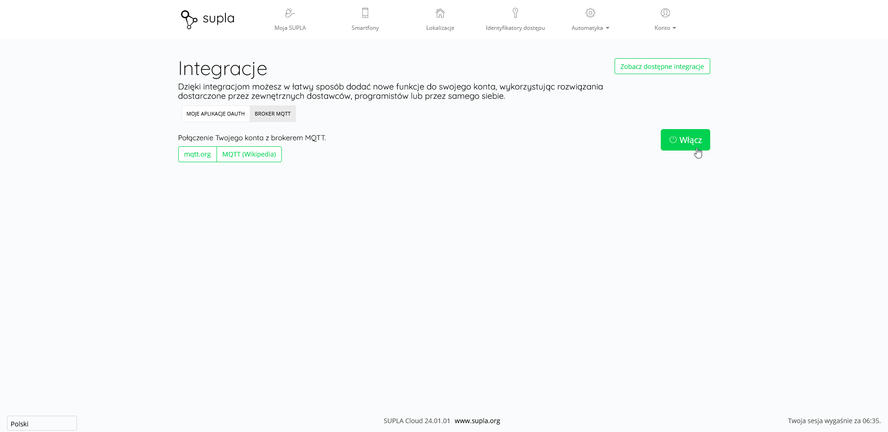

2. Włączyć `Tryb zaawansowany` w Home Assistancie (`Profil` -> `Tryb zaawansowany`) - umożliwi on  odpowiednią konfigurację MQTT

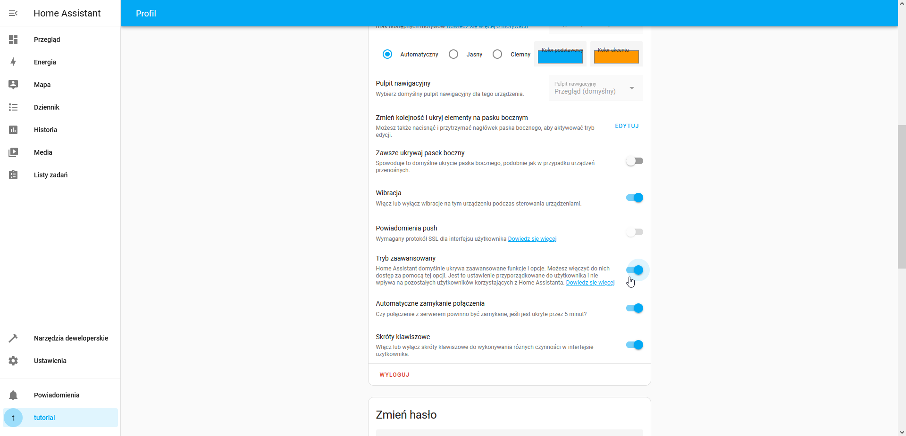

3. Dodać integrację MQTT (`Ustawienia` -> `Urządzenia oraz usługi` -> `Dodaj integrację` -> `MQTT` -> `MQTT`)


  
  


4. Uzupełnić dane MQTT z Clouda

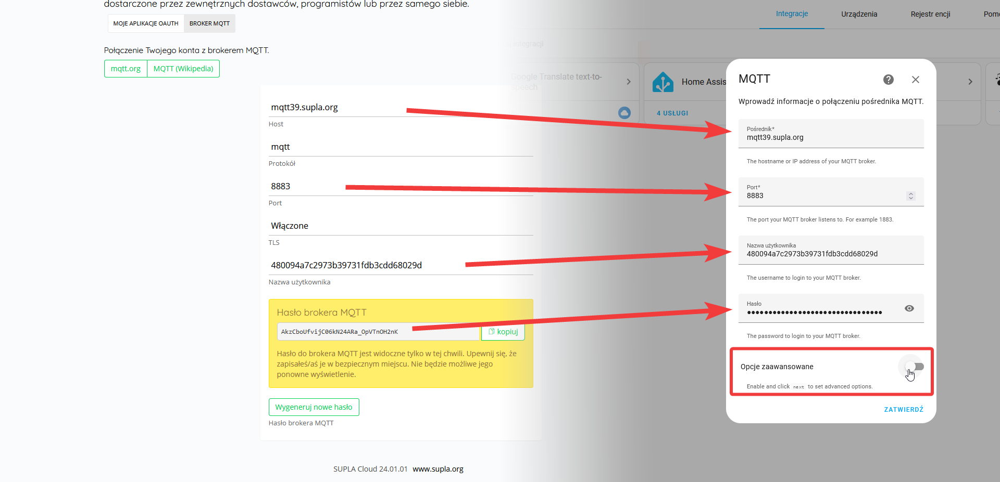

5. Włączyć `Opcje zaawansowane` i kliknąć `Zatwierdź`

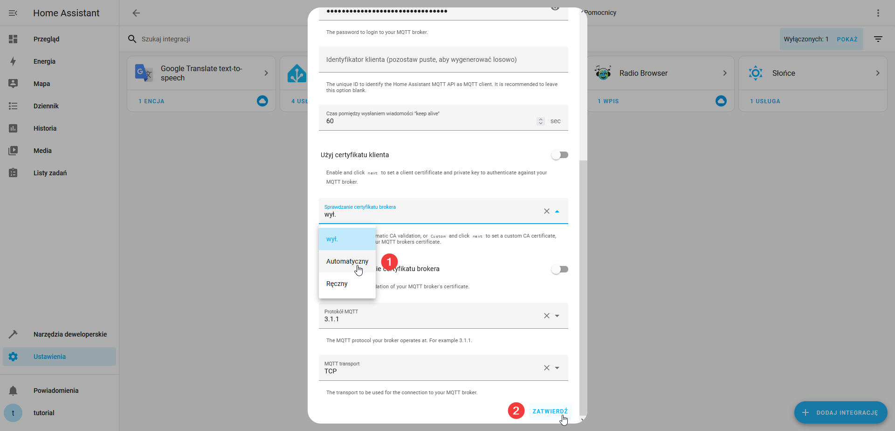

6. Ustawić Sprawdzanie certyfikatu brokera na `Automatyczny` i kliknąć `Zatwierdź`
7. Po zapisaniu ustawień Home Assistant powinien od razu połączyć się z brokerem i zaimportować listę urządzeń.

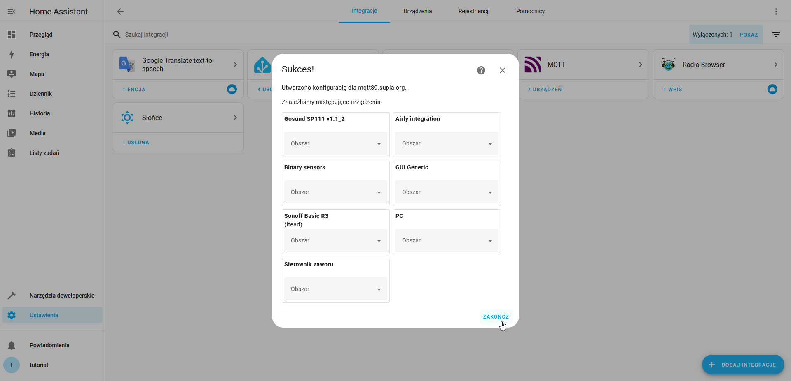

### B - W przypadku posiadania już skonfigurowanego brokera MQTT proces integracji wygląda odmiennie:

1. Wejść w konfigurację brokera Mosquitto (`Ustawienia` -> `Dodatki` -> `Mosquitto broker` -> `Konfiguracja`)
2. Dopisać do konfiguracji:
````
active: true
folder: mosquitto
````
i zapisać zmiany.

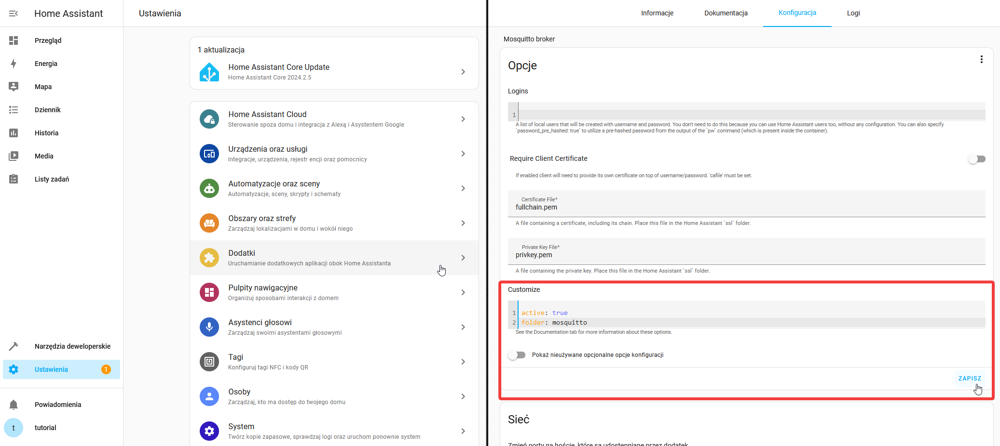

3. Zainstalować i otworzyć Terminal & SSH (`Ustawienia` -> `Dodatki` -> `Sklep z dodatkami` -> `“Terminal & SSH”` -> `Zainstaluj`)

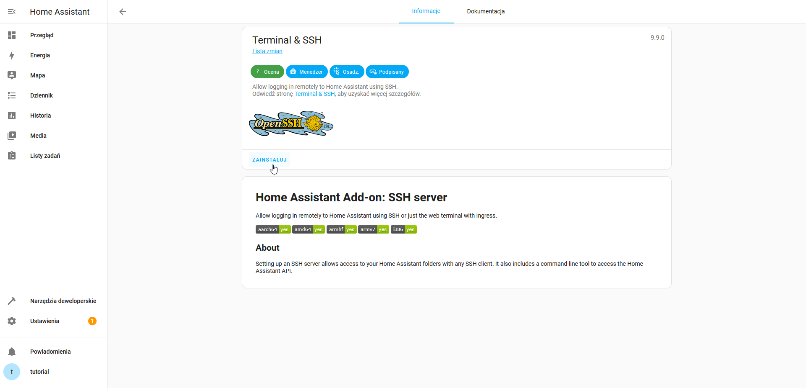

4. Przejść do folderu _/share/mosquitto_ `cd /share/mosquitto`

> [!TIP]
> Jeśli folder nie istnieje utworzyć go najpierw poleceniem `mkdir -p /share/mosquitto`

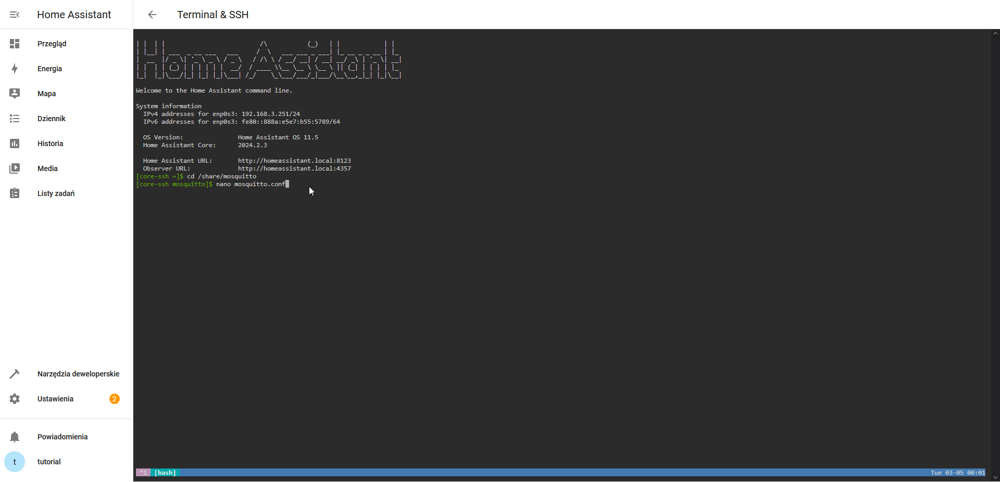

5. Otworzyć plik _mosquitto.conf_ (`nano mosquitto.conf`) i wprowadzić poniższą konfigurację:

> [!WARNING]
> ````
> connection bridge-RANDOM
>
> address ADRES:8883
> topic supla/# in
> topic homeassistant/# in
> topic supla/+/devices/+/channels/+/execute_action out
> topic supla/+/devices/+/channels/+/set/+ out
> remote_username UŻYTKOWNIK
> remote_password HASŁO
> bridge_capath /etc/ssl/certs
> ````
>
> W miejsce `RANDOM` należy wstawić ciąg 8-16 przypadkowych znaków trudnych do odgadnięcia przez innych użytkowników składający się z małych idużych liter oraz cyfr (nie należy używać znaków specjalnych). 
>
> W `ADRES` należy wpisać adres serwera odczytany z pola `Host` na cloud.supla.org -> `Konto`-> `Integracje` -> `Broker MQTT`. Na końcu `ADRES` należydodać `:8883`
>
> W miejsce `UŻYTKOWNIK` nazwę użytkownika logowania do brokera MQTT, którą należy odczytać z cloud.supla.org
>
> W miejsce `HASŁO` należy wpisać hasło, które zostało wygenerowane podczas włączania brokera mqtt na cloud.supla.org.
>
> 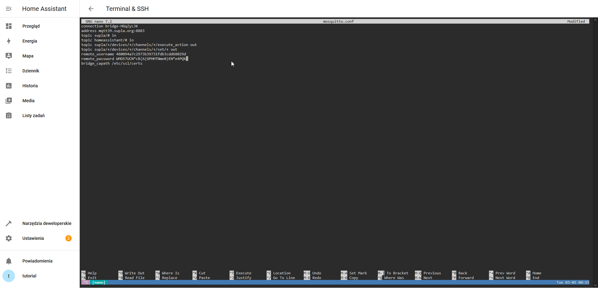

6. Zapisać konfigurację
7. Wyjść z SSH
8. Zrestartować Home Assistanta (`Ustawienia` -> `Trzy kropki` -> `Uruchom ponownie Home Assistanta` -> `Uruchom ponownie system`)

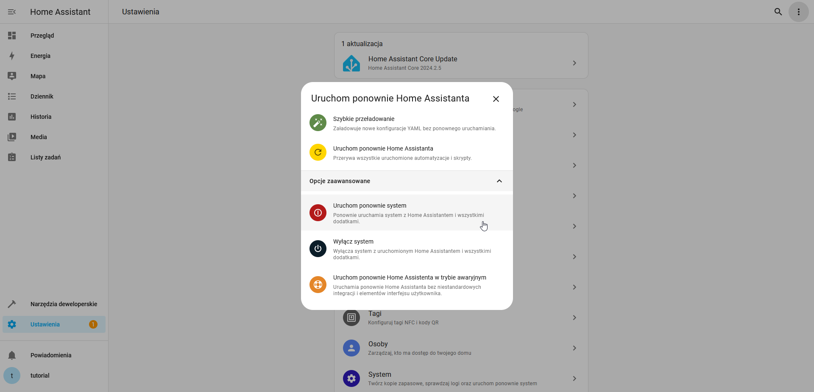

9. Urządzenia podłączone do Clouda powinny pojawić się w Home Assistatncie. Można to sprawdzić w zakładce `Ustawienia` -> `Urządzenia oraz usługi` -> `MQTT` -> `Urządzenia`


### Integracja MQTT dla prywatnych instancji serwera Supla

W przypadku prywatnych instancji należy zapewnić broker we własnym zakresie. Najprostszą metodą jest uruchomienie Mosquitto na Home Assistancie. W tym celu należy:
1. Zainstalować Mosquitto, czyli broker MQTT (`Ustawienia` -> `Dodatki` -> `Sklep z dodatkami` -> `“Mosquitto broker”` -> `Zainstaluj`) i go uruchomić


  
  


2. Utworzyć użytkownika mqtt-user, którego dane będą potrzebne przy łączeniu się z brokerem (`Ustawienia` -> `Osoby` -> `Dodaj osobę`). Jego hasło będzie jednocześnie hasłem do Brokera.

> [!TIP]
> Jeśli Home Assistant działa w tej samej sieci LAN, co kontenery Supli, to warto ograniczyć logowanie użytkownika mqtt-user do sieci lokalnej.


  
  
  


3. Zrestartować Home Assistanta (`Ustawienia` -> `Trzy kropki` -> `Uruchom ponownie Home Assistanta` -> `Uruchom ponownie system`)


4. Dodać integrację MQTT (powinna zostać wykryta automatycznie)

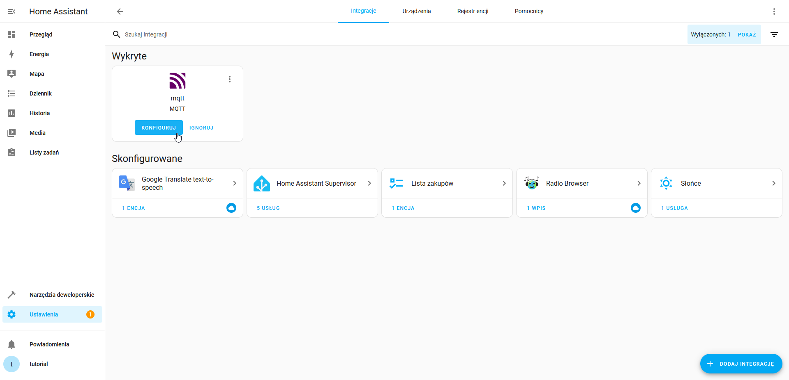

5. Dalej należy otworzyć plik konfiguracyjny Supli .env i ustawić w nim dane brokera MQTT

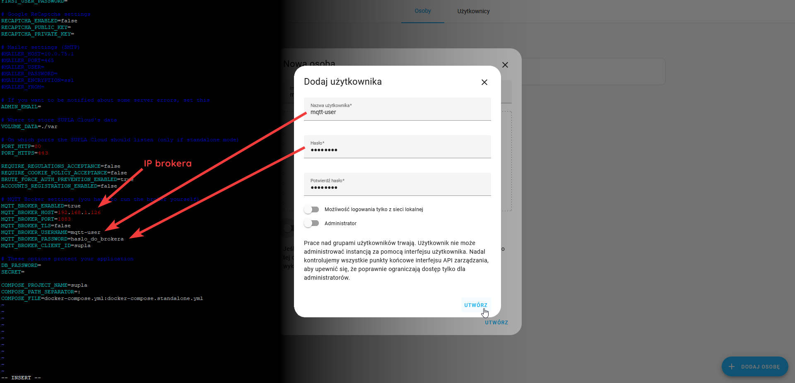

6. Zrestartować Suplę `./supla.sh restart`
7. Urządzenia podłączone do Clouda powinny pojawić się w Home Assistatncie. Można to sprawdzić w zakładce `Ustawienia` -> `Urządzenia oraz usługi` -> `MQTT` -> `Urządzenia`

> [!WARNING]
> Jeśli urządzenia nie są widoczne warto sprawdzić z poziomu Clouda czy MQTT jest włączone (`Konto` -> `Integracje` -> `MQTT` -> `Włącz`)

> [!NOTE]
> Home Assistant może potrzebować kilku minut na wyświetlenie urządzeń - cierpliwość zalecana.

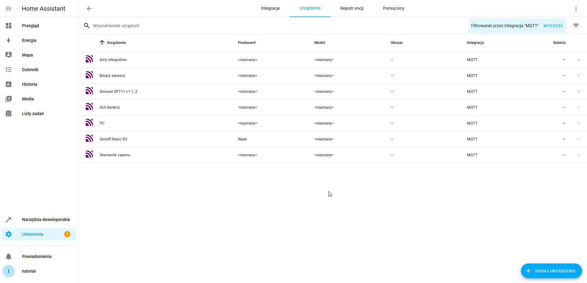
