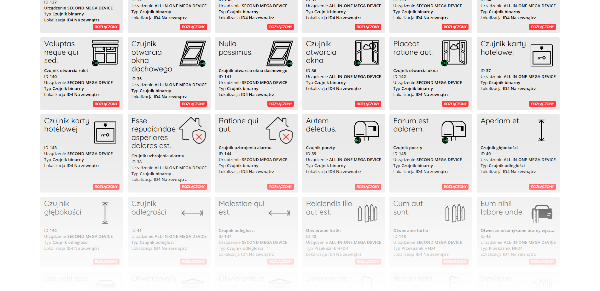
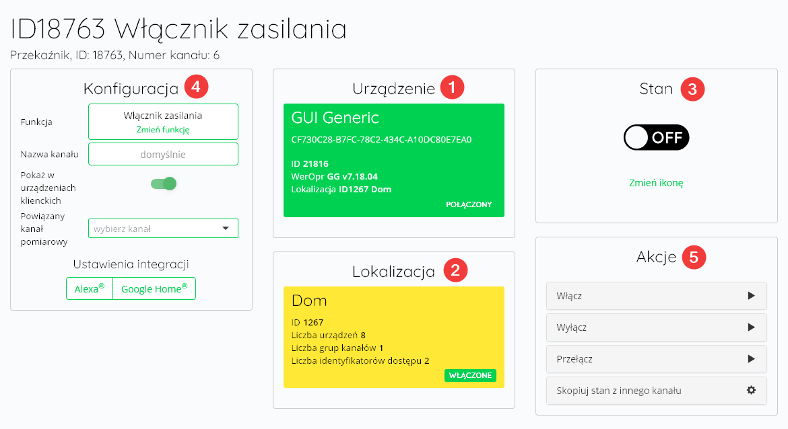
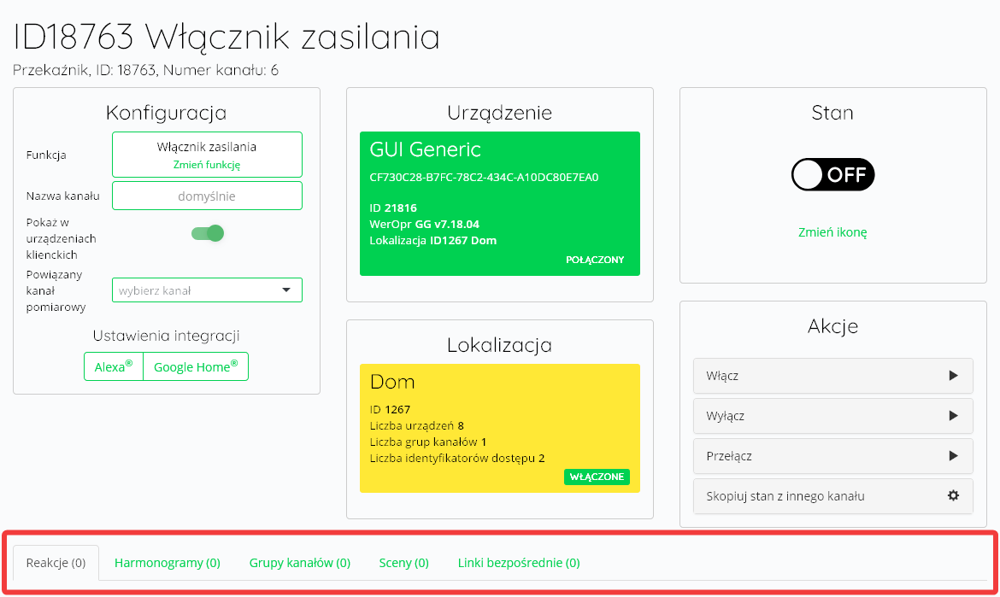

W tym dziale omówiono działanie wszystkich dostępnych rodzajów kanałów i dostępnych funkcji.

## Kanały - cd.

Widok kanału składa się zazwyczaj z czterech lub pięciu sekcji (4 dla sensorów, 5 dla urządzeń wykonawczych):
1. **Urządzenie** - kliknięcie w kafelek powoduje powrót do menu urządzenia i listy jego kanałów
2. **Lokalizacja** - wybór lokalizacji kanału. Domyślnie jest to lokalizacja, do której przypisano urządzenie
3. **Stan** - ikona kanału, zmienia się zależnie od jego stanu. W przypadku kanałów pomiarowych prezentowane są tam aktualne odczyty. 

> [!TIP]
> Więcej na temat zmiany ikon w dziale Funkcje Clouda.

4. **Konfiguracja** - sekcja, w której konfiguruje się zachowanie urządzenia. Różni się w zależności od rodzaju kanału - poszczególne możliwości konfiguracji zostały omówione w dalszej części vademecum
5. **Akcje** - lista akcji, jakie może wykonać urządzenie - widoczna tylko dla urządzeń wykonawczych. Różni się w zależności od rodzaju kanału.

> [!CAUTION]
> Po zapisaniu zmiany któregoś z ustawień kanału urządzenia zresetują swoje połączenie z Cloudem.

Pod wymienionymi sekcjami w zależności od rodzaju kanału znajdują się odpowiednie karty. Poniżej zamieszczono spis dostępnych kart i ich funkcji.

- **Wyzwalacze akcji** - umożliwiają wykonanie wybranej akcji po określonym zachowaniu elementu sterującego. Więcej na ten temat w dziale Funkcje Clouda.
- **Harmonogramy** - wyświetla harmonogramy z wybranym kanałem
- **Grupy kanałów** - wyświetla Grupy kanałów z wybranym kanałem
- **Sceny** - wyświetla Sceny zawierające wybrany kanał
- **Linki bezpośrednie** - wyświetla Linki bezpośrednie zawierające wybrany kanał
- **Reakcje** - wyświetla Reakcje zawierające wybrany kanał
- **Historia pomiarów** - wyświetla historię pomiarów kanału
- **Aberracje napięcia** - wyświetla historię zmierzonych aberracji napięcia.

## Typy kanałów


  
  
  
  
  
  
  
  

