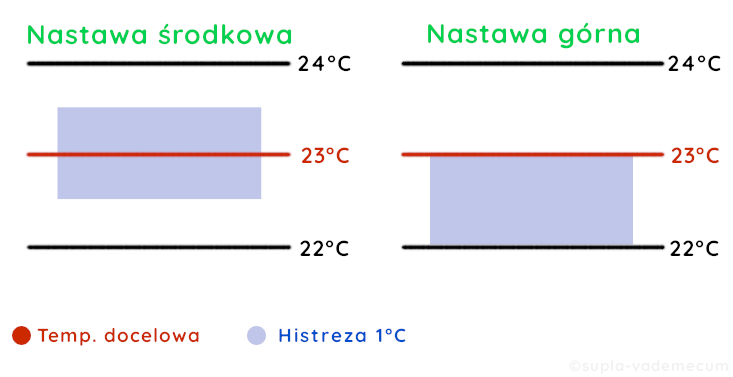

## Termostat

Kanał termostatu umożliwia osobną konfigurację dla grzania i chłodzenia (Podfunkcja grzanie/chłodzenie) - w zależności od tego, która zostanie wybrana, zawartość menu minimalnie się zmieni. Zasada konfiguracji pozostanie jednak analogiczna.

<ins>Konfiguracja:</ins>

- **Nazwa kanału** - ustawienie własnej nazwy kanału wyświetlanej w Cloudzie i aplikacji SUPLA
- **Pokaż w urządzeniach klienckich** - wyłączenie spowoduje ukrycie kanału w aplikacji SUPLA
- **Termometr główny** - ustaw główny termometr termostatu
- **Termometr dodatkowy** (opcjonalny) - ustaw termometr, którego wartość temperatury będzie warunkowała aktywność termostatu (zgodnie z dalszymi ustawieniami)

> [!NOTE]
> Termometry muszą być podłączone bezpośrednio do urządzenia.

- **Typ termometru dodatkowego** - określ, co mierzy termometr dodatkowy (wyłączony/podłoga/woda/źródło chłodu/źródło ciepła)
- **Włącz kontrolę temperatury** - włączenie umożliwi konfigurację minimalnej i maksymalnej temperatury, jaka może wystąpić na wybranym czujniku - niespełnienie warunku wiąże się z dezaktywacją termostatu
  - **Ochrona przeciwzamrożeniowa** - gdy włączone, termostat utrzyma temperaturę powyżej zadanej nawet w trybie wyłączony
  - **Ochrona przed przegrzaniem** - gdy włączone, termostat utrzyma temperaturę poniżej zadanej nawet w trybie wyłączony
- **Zewnętrzny czujnik wyłączający termostat** (opcjonalny) - czujnik binarny podłączony do tego samego urządzenia, załączenie czujnika wyłącza termostat
- **Algorytm** - wybierz algorytm włączania/wyłączania działający na podstawie histerezy. Histereza może działać z odniesieniem do połowy swojego zakresu (Nastawa środkowa) lub swojej pełnej wartości (Nastawa górna)
- **Histereza** - ustaw histerezę (dokładność 0,1°C), czyli maksymalną dopuszczalną różnicę między aktualną, a ustawioną temperaturą

> [!NOTE] Przykład
> Docelowa temperatura: 23°C, histereza: 1°C
>
> | | Włączy, gdy temp. wyniesie | Wyłączy, gdy temp. wyniesie |
> |---|---|---|
> | Nastawa środkowa | 22,5°C | 23,5°C |
> | Nastawa górna | 22°C | 23°C |

- **Minimalny czas włączenia przed ponownym wyłączeniem ogrzewania/chłodzenia** - kiedy temperatura znajdzie się na “granicy histerezy” termostat może włączać się i wyłączać co chwilę, ustawiony czas pozwoli stworzyć “margines” dla takich sytuacji (min. 0s maks. 600s=10min)
- **Minimalny czas wyłączenia przed ponownym włączeniem ogrzewania/chłodzenia** - kiedy temperatura znajdzie się na “granicy histerezy” termostat może włączać się i wyłączać co chwilę, ustawiony czas pozwoli stworzyć “margines” dla takich sytuacji (min. 0s maks. 600s=10min)
- **Stan wyjścia podczas błędu** - ustaw, co ma zrobić termostat po wykryciu błędu (wyłącz/grzanie lub chłodzenie)

> [!WARNING]
> Domyślnie termostat po wykryciu błędu w działaniu powinien się wyłączyć (np. w przypadku awarii termometru głównego). Nie zmieniaj tego zachowania, jeśli nie jesteś absolutnie pewny, jakie będzie to mieć skutki.

- **Zmiana temperatury docelowej przełącza w tryb manualny** - ustaw zachowanie po zmianie temperatury docelowej
- **Ustawienia integracji** - ustawienie widoczności i działania kanału w Google Home i Alexie, więcej na ten temat w dziale [Funkcje Clouda](/cloud/funkcje-clouda).

| Akcje |
|---|
| Włącz |
| Wyłącz |
| Przełącz w tryb programu |
| Przełącz w tryb manualny |
| Ustaw temperaturę |

Dostępne zakładki: `Tydzień`, `Reakcje`, `Grupy kanałów`, `Sceny`, `Linki bezpośrednie`

<ins>Tydzień</ins>:

W widoku tygodnia użytkownik może zaprogramować działanie termostatu w programie tygodniowym. Do wyboru są cztery konfigurowalne temperatury (+wyłącz) w 15-minutowych komórkach.

1. Edytuj ustawienia termostatu - ustaw każdą z czterech możliwych temperatur (możliwa dokładność to 0,1°C). Wprowadzone zmiany potwierdź przyciskiem `OK`
2. Wybierz tryb termostatu (jedną z czterech zdefiniowanych temperatur lub wyłącz) i zaznacz komórki, które mają być nim objęte (każda komórka odpowiada 15 minutom)

> [!NOTE]
> Możesz masowo edytować komórki poprzez przytrzymanie lewego przycisku myszy i przeciągnięcie kursorem po wybranym obszarze. Jeśli chcesz skopiować konfigurację danego dnia kliknij symbol :page_facing_up: znajdujący się poniżej kolumny, a następnie ikonę wałka, aby wkleić skopiowane ustawienie.

3. Kliknij `Zapisz zmiany`, aby potwierdzić wybór.

## Termostat różnicowy

Termostat różnicowy działa na bazie różnicy temperatur z dwóch czujników temperatury. Zgodnie z konfiguracją może załączać się, gdy temperatura jednego jest niższa/wyższa od temperatury drugiego i wyłączać się gdy spełniony jest warunek przeciwny (np.  jeśli temperatura A jest większa od B to załącz, jeśli nie - wyłącz). Ta funkcja nie jest jeszcze wspierana.

## Ciepła woda w domu

W ramach tej funkcji można łatwo kontrolować temperaturę CWU w domu.

<ins>Konfiguracja:</ins>

- **Nazwa kanału** - ustawienie własnej nazwy kanału wyświetlanej w Cloudzie i aplikacji SUPLA
- **Pokaż w urządzeniach klienckich** - wyłączenie spowoduje ukrycie kanału w aplikacji SUPLA
- **Termometr główny** - ustaw główny termometr termostatu
- **Termometr dodatkowy** (opcjonalny) - ustaw termometr, którego wartość temperatury będzie warunkowała aktywność termostatu (zgodnie z dalszymi ustawieniami)

> [!NOTE]
> Termometry muszą być podłączone bezpośrednio do urządzenia.

- **Typ termometru dodatkowego** - określ, co mierzy termometr dodatkowy (wyłączony/podłoga/woda/źródło chłodu/źródło ciepła)
- **Włącz kontrolę temperatury** - włączenie umożliwi konfigurację minimalnej i maksymalnej temperatury, jaka może wystąpić na wybranym czujniku - niespełnienie warunku wiąże się z dezaktywacją termostatu
- **Ochrona przeciwzamrożeniowa** - gdy włączone, termostat utrzyma temperaturę powyżej zadanej nawet w trybie wyłączony
- **Zewnętrzny czujnik wyłączający termostat** (opcjonalny) - czujnik binarny podłączony do tego samego urządzenia, załączenie czujnika wyłącza termostat
- **Algorytm** - wybierz algorytm włączania/wyłączania działający na podstawie histerezy. Histereza może działać z odniesieniem do połowy swojego zakresu (Nastawa środkowa) lub swojej pełnej wartości (Nastawa górna)
- **Histereza** - ustaw histerezę (dokładność 0,1°C), czyli maksymalną dopuszczalną różnicę między aktualną, a ustawioną temperaturą

> [!NOTE] Przykład
> Docelowa temperatura: 23°C, histereza: 1°C
>
> | | Włączy, gdy temp. wyniesie | Wyłączy, gdy temp. wyniesie |
> |---|---|---|
> | Nastawa środkowa | 22,5°C | 23,5°C |
> | Nastawa górna | 22°C | 23°C |

Dobrze ilustruje to poniższa grafika:

{data-zoomable="true"}

- **Minimalny czas włączenia przed ponownym wyłączeniem ogrzewania** - kiedy temperatura znajdzie się na “granicy histerezy” termostat może włączać się i wyłączać co chwilę, ustawiony czas pozwoli stworzyć “margines” dla takich sytuacji (min. 0s maks. 600s=10min)
- **Minimalny czas wyłączenia przed ponownym włączeniem ogrzewania** - kiedy temperatura znajdzie się na “granicy histerezy” termostat może włączać się i wyłączać co chwilę, ustawiony czas pozwoli stworzyć “margines” dla takich sytuacji (min. 0s maks. 600s=10min)
- **Stan wyjścia podczas błędu** - ustaw, co ma zrobić termostat po wykryciu błędu (wyłącz/grzanie)

> [!WARNING]
> Domyślnie termostat po wykryciu błędu w działaniu powinien się wyłączyć (np. w przypadku awarii termometru głównego). Nie zmieniaj tego zachowania, jeśli nie jesteś absolutnie pewny, jakie będzie to mieć skutki.

- **Zmiana temperatury docelowej przełącza w tryb manualny** - ustaw zachowanie po zmianie temperatury docelowej
- **Ustawienia integracji** - ustawienie widoczności i działania kanału w Google Home i Alexie, więcej na ten temat w dziale [Funkcje Clouda](/cloud/funkcje-clouda).

| Akcje |
|---|
| Włącz |
| Wyłącz |
| Przełącz w tryb programu |
| Przełącz w tryb manualny |
| Ustaw temperaturę |

Dostępne zakładki: `Tydzień`, `Reakcje`, `Grupy kanałów`, `Sceny`, `Linki bezpośrednie`

<ins>Tydzień</ins>:

W widoku tygodnia użytkownik może zaprogramować działanie termostatu w programie tygodniowym. Do wyboru są cztery konfigurowalne temperatury (+wyłącz) w 15-minutowych komórkach.

1. Edytuj ustawienia termostatu - ustaw każdą z czterech możliwych temperatur (możliwa dokładność to 0,1°C). Wprowadzone zmiany potwierdź przyciskiem `OK`
2. Wybierz tryb termostatu (jedną z czterech zdefiniowanych temperatur lub wyłącz) i zaznacz komórki, które mają być nim objęte (każda komórka odpowiada 15 minutom)

> [!NOTE]
> Możesz masowo edytować komórki poprzez przytrzymanie lewego przycisku myszy i przeciągnięcie kursorem po wybranym obszarze. Jeśli chcesz skopiować konfigurację danego dnia kliknij symbol :page_facing_up: znajdujący się poniżej kolumny, a następnie ikonę wałka, aby wkleić skopiowane ustawienie.

3. Kliknij `Zapisz zmiany`, aby potwierdzić wybór.
