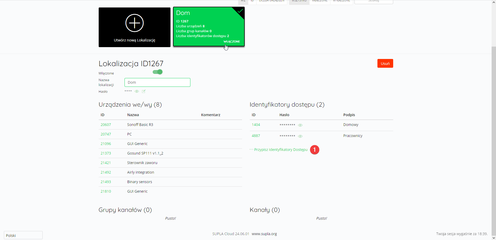

Lokalizacje to zbiory, do których można przypisywać wybrane kanały oraz grupy kanałów. 

Wyświetlają się one w aplikacji SUPLA w postaci kaskadowo ułożonych list. Istnieje możliwość przypisania poszczególnych lokalizacji do różnych identyfikatorów dostępu :one:.

{data-zoomable="true"}

Nową lokalizację można utworzyć klikając przycisk `Utwórz nową lokalizację` znajdujący się w prawym górnym rogu. Istnieje również możliwość edycji istniejących lokalizacji, której można dokonać wybierając daną lokalizację z listy. Dokonane zmiany należy zatwierdzić przyciskiem `Zapisz zmiany`.


  
  
  
