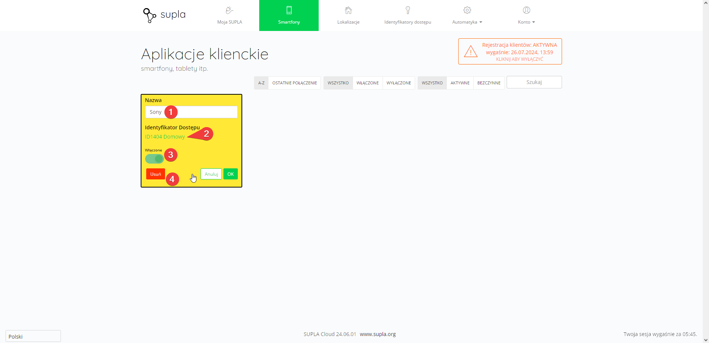

W zakładce Smartfony można zarządzać telefonami, które za pomocą aplikacji SUPLA mają dostęp do konta. Po kliknięciu w wybrany kafelek istnieje możliwość edycji wyświetlanej w Cloudzie nazwy telefonu :one:, zmiany przypisanego identyfikatora dostępu :two: (aby edytować, kliknij w zielony napis), wyłączenia urządzenia :three: (tymczasowego odbioru dostępu do konta) oraz usunięcia urządzenia z konta :four:. 

Aby zarejestrować nowe urządzenie należy:

1. Włączyć rejestrację klientów
2. Uzupełnić dane konta w aplikacji SUPLA na urządzeniu mobilnym
3. Wyłączyć rejestrację klientów.

> [!WARNING]
> W przypadku niewyłączenia rejestracji klientów, dezaktywuje się ona automatycznie po upływie 24 godzin.


  
  
  

