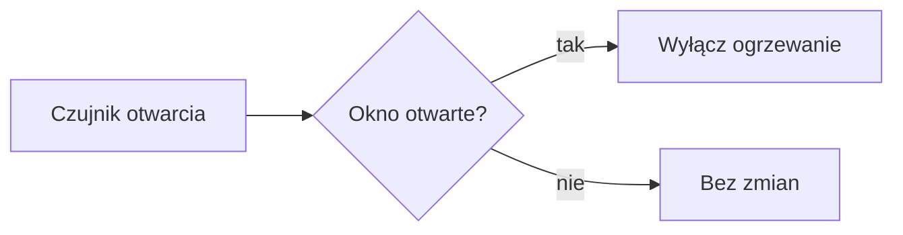

Jak w edytorze [Pages CMS](https://app.pagescms.org/jaku2019/supla-vademecum/cms) wstawić elementy motywu Hextra: ramki z uwagami, rozwijane odpowiedzi, zakładki, kroki, karty, galerie i inne.

Każdy przykład ma dwie części: **W edytorze** pokazuje, co dokładnie ma być widać w polu „Treść” w CMS, a **Na stronie** – jak to wygląda po opublikowaniu.

## Zasady ogólne

- **Każda linia w podwójnych nawiasach klamrowych `{{ }}` to osobny akapit.** Po każdej naciśnij Enter. Tekst między linią otwierającą a zamykającą też wpisuj w osobnych akapitach.
- **Każdy element otwarty musi zostać zamknięty**, np. `` … ``. Brak zamknięcia przerywa budowanie strony.
- **Przepisuj nawiasy dokładnie jak w przykładzie** – `` i `{}` to nie to samo.
- **Cudzysłowy muszą być proste** (`"`), a nie drukarskie (`„ ”`). Uważaj przy wklejaniu tekstu z Worda.
- **Nie formatuj tych linii** (bez pogrubienia, kursywy czy przycisku „Code”) – muszą zostać zwykłym tekstem.
- **Ramkę „W edytorze” możesz skopiować.** Zaznacz jej zawartość myszką, skopiuj i wklej do edytora – akapity i cytaty zostaną zachowane. Potem podmień przykładowy tekst na własny.
- Po zapisie GitHub sprawdza, czy strona się buduje (zakładka `Actions`, „Build check”). Czerwony krzyżyk to zwykle niezamknięty element albo literówka w nawiasach.

## Ramki z uwagami

Kolorowa ramka z ikoną i tytułem. To główny sposób wyróżniania uwag na stronach Vademecum.

**Jak wstawić:** na początku pustej linii wpisz `>` i spację (albo `/` → „Quote”) – linia zmieni się w cytat. W cytacie wpisz `[!TIP]`, naciśnij Enter i wpisz treść. Dwa razy Enter kończy cytat.

<div class="sciaga"><div class="sciaga-edytor">
<blockquote><p>[!TIP]</p><p>Lokalizację można przypisać do kilku identyfikatorów dostępu.</p></blockquote>
</div><div class="sciaga-efekt">

> [!TIP]
>
> Lokalizację można przypisać do kilku identyfikatorów dostępu.

</div></div>

### Pozostałe rodzaje

Zamiast `TIP` wpisz jedno z: `NOTE`, `IMPORTANT`, `WARNING`, `CAUTION`. Wielkie litery są obowiązkowe.

<div class="sciaga"><div class="sciaga-edytor">
<blockquote><p>[!NOTE]</p><p>Informacja – ramka niebieska.</p></blockquote>
<blockquote><p>[!IMPORTANT]</p><p>Ważne – ramka fioletowa.</p></blockquote>
<blockquote><p>[!WARNING]</p><p>Uwaga – ramka żółta.</p></blockquote>
<blockquote><p>[!CAUTION]</p><p>Ostrzeżenie – ramka czerwona.</p></blockquote>
</div><div class="sciaga-efekt">

> [!NOTE]
>
> Informacja – ramka niebieska.

> [!IMPORTANT]
>
> Ważne – ramka fioletowa.

> [!WARNING]
>
> Uwaga – ramka żółta.

> [!CAUTION]
>
> Ostrzeżenie – ramka czerwona.

</div></div>

### Własny tytuł

Tytuł wpisz za nawiasem, w tej samej linii.

<div class="sciaga"><div class="sciaga-edytor">
<blockquote><p>[!WARNING] Przed aktualizacją</p><p>Upewnij się, że urządzenie ma stabilne zasilanie.</p></blockquote>
</div><div class="sciaga-efekt">

> [!WARNING] Przed aktualizacją
>
> Upewnij się, że urządzenie ma stabilne zasilanie.

</div></div>

### Zwykły cytat

Cytat bez `[!…]` w pierwszej linii zostaje zwykłym cytatem z szarą kreską.

<div class="sciaga"><div class="sciaga-edytor">
<blockquote><p>Lista aktualizacji znajduje się pod adresem updates.supla.org.</p></blockquote>
</div><div class="sciaga-efekt">

> Lista aktualizacji znajduje się pod adresem updates.supla.org.

</div></div>

## Callout

Alternatywa dla ramek z uwagami – element Hextry z innym zestawem kolorów i możliwością podania własnej ikony lub emoji. Na stronach Vademecum zwykle wystarczają [ramki z uwagami](#ramki-z-uwagami).

Rodzaje (`type`): bez parametru (zielony), `info`, `warning`, `error`, `important`.

<div class="sciaga"><div class="sciaga-edytor">
<p>{{&lt; callout type="info" &gt;}}</p>
<p>Moduł po aktualizacji uruchomi się ponownie.</p>
<p>{{&lt; /callout &gt;}}</p>
</div><div class="sciaga-efekt">



Moduł po aktualizacji uruchomi się ponownie.



</div></div>

<div class="sciaga"><div class="sciaga-edytor">
<p>{{&lt; callout &gt;}}</p>
<p>Domyślny callout – zielony, z żarówką.</p>
<p>{{&lt; /callout &gt;}}</p>
<p>{{&lt; callout type="error" &gt;}}</p>
<p>Błąd – czerwony.</p>
<p>{{&lt; /callout &gt;}}</p>
<p>{{&lt; callout emoji="🔌" &gt;}}</p>
<p>Własne emoji zamiast ikony.</p>
<p>{{&lt; /callout &gt;}}</p>
</div><div class="sciaga-efekt">



Domyślny callout – zielony, z żarówką.





Błąd – czerwony.





Własne emoji zamiast ikony.



</div></div>

## Rozwijana odpowiedź

Treść schowana pod klikalnym nagłówkiem – tak są zbudowane odpowiedzi w [FAQ](/cloud/faq). Pytanie wpisz jako nagłówek („Heading 2”), a odpowiedź między liniami `details`.

`closed="true"` – odpowiedź jest zwinięta po wejściu na stronę. Bez tego parametru jest rozwinięta.

<div class="sciaga"><div class="sciaga-edytor">
<h2>Jak zresetować moduł?</h2>
<p>{{&#37; details title="Odpowiedź" closed="true" &#37;}}</p>
<p>Przytrzymaj przycisk <strong>CONFIG</strong> przez 10 sekund.</p>
<p>{{&#37; /details &#37;}}</p>
</div><div class="sciaga-efekt">

<p class="sciaga-naglowek">Jak zresetować moduł?</p>

{}

Przytrzymaj przycisk **CONFIG** przez 10 sekund.

{}

</div></div>

W środku odpowiedzi działa całe formatowanie: pogrubienia, listy, zdjęcia, ramki z uwagami.

## Zakładki

Kilka wariantów tej samej treści, np. dla Androida i iOS. Każda zakładka to para linii `tab` z nazwą w `name`.

<div class="sciaga"><div class="sciaga-edytor">
<p>{{&lt; tabs &gt;}}</p>
<p>{{&lt; tab name="Android" &gt;}}</p>
<p>Otwórz <strong>Ustawienia</strong> → <strong>Aplikacje</strong> → <strong>SUPLA</strong>.</p>
<p>{{&lt; /tab &gt;}}</p>
<p>{{&lt; tab name="iOS" &gt;}}</p>
<p>Otwórz <strong>Ustawienia</strong> → <strong>SUPLA</strong>.</p>
<p>{{&lt; /tab &gt;}}</p>
<p>{{&lt; /tabs &gt;}}</p>
</div><div class="sciaga-efekt">





Otwórz **Ustawienia** → **Aplikacje** → **SUPLA**.





Otwórz **Ustawienia** → **SUPLA**.





</div></div>

Domyślnie otwarta jest pierwsza zakładka. Aby otworzyć inną, dopisz do niej `selected=true`, np. ``.

## Kroki

Ponumerowana instrukcja z pionową linią. Każdy krok zaczyna się od nagłówka **„Heading 3”** (z listy stylów albo `/` → „Heading 3”) – zwykły akapit nie utworzy kroku.

<div class="sciaga"><div class="sciaga-edytor">
<p>{{&#37; steps &#37;}}</p>
<h3>Przełącz moduł w tryb konfiguracji</h3>
<p>Przytrzymaj przycisk CONFIG, aż dioda zacznie szybko migać.</p>
<h3>Połącz się z siecią modułu</h3>
<p>W telefonie wybierz sieć Wi-Fi o nazwie zaczynającej się od SUPLA.</p>
<h3>Wpisz dane sieci domowej</h3>
<p>Otwórz stronę 192.168.4.1 i zapisz ustawienia.</p>
<p>{{&#37; /steps &#37;}}</p>
</div><div class="sciaga-efekt">

{}

### Przełącz moduł w tryb konfiguracji

Przytrzymaj przycisk CONFIG, aż dioda zacznie szybko migać.

### Połącz się z siecią modułu

W telefonie wybierz sieć Wi-Fi o nazwie zaczynającej się od SUPLA.

### Wpisz dane sieci domowej

Otwórz stronę 192.168.4.1 i zapisz ustawienia.

{}

</div></div>

## Karty

Klikalne kafelki z linkami.

### Karty podstron sekcji

Na stronie sekcji (np. [Automatyka](/cloud/automatyka)) jedna linia wstawia karty wszystkich podstron tej sekcji – nowa podstrona dodana w CMS pojawi się na nich sama. Tytuł karty to „Tytuł w menu” (albo „Tytuł”) podstrony, a podtytuł i ikonę ustawisz w polach **Opis na karcie** i **Ikona na karcie** w formularzu podstrony.

<div class="sciaga"><div class="sciaga-edytor">
<p>{{&lt; podstrony &gt;}}</p>
</div><div class="sciaga-efekt">

Wygląda jak karty poniżej, ale z podstronami sekcji. Działa tylko na stronie sekcji, która ma podstrony – zobacz [Automatykę](/cloud/automatyka) albo [Kanały](/cloud/kanaly).

</div></div>

### Karty ręczne

Dowolne karty z wybranymi linkami. Adres strony Vademecum wpisz jak w zwykłym linku: od `/cloud/`, np. `/cloud/lokalizacje`. `icon` i `subtitle` są opcjonalne; nazwy ikon są na liście „Ikona na karcie” w CMS (np. `cloud`, `clock`, `cog`, `device-mobile`).

<div class="sciaga"><div class="sciaga-edytor">
<p>{{&lt; cards &gt;}}</p>
<p>{{&lt; card link="/cloud/lokalizacje" title="Lokalizacje" subtitle="Grupowanie kanałów w aplikacji" icon="home" &gt;}}</p>
<p>{{&lt; card link="/cloud/automatyka/harmonogramy" title="Harmonogramy" icon="clock" &gt;}}</p>
<p>{{&lt; card link="https://forum.supla.org" title="Forum Supli" icon="globe-alt" &gt;}}</p>
<p>{{&lt; /cards &gt;}}</p>
</div><div class="sciaga-efekt">







</div></div>

Liczbę kolumn ustawisz parametrem `cols`, np. ``.

## Galeria zdjęć

Kilka zdjęć przewijanych strzałkami, z powiększeniem po kliknięciu.

Najpierw wgraj zdjęcia do folderu strony (przycisk „obrazek” w pasku edytora – zdjęcie, które wstawi się w tekście, możesz potem usunąć; plik zostaje w folderze). W `src` wpisz **samą nazwę pliku**, bez ścieżki – nazwa po wgraniu jest bez spacji i polskich znaków, sprawdzisz ją w oknie wyboru zdjęcia.

<div class="sciaga"><div class="sciaga-edytor">
<p>{{&lt; gallery type="carousel" &gt;}}</p>
<p>{{&lt; gallery-item src="app_rejestr1.png" caption="Włączanie rejestracji" &gt;}}</p>
<p>{{&lt; gallery-item src="app_klik.png" caption="Zarejestrowany telefon" &gt;}}</p>
<p>{{&lt; /gallery &gt;}}</p>
</div><div class="sciaga-efekt">


  
  


</div></div>

Zamiast `carousel` możesz wpisać `grid` (siatka miniatur, domyślnie 3 kolumny; liczbę zmienisz parametrem `cols="2"`).

## Odznaki

Mała etykieta w tekście, np. przy nowej funkcji. Wpisuje się ją w środku zwykłego akapitu. Kolory (`color`): `gray`, `blue`, `green`, `yellow`, `orange`, `amber`, `red`, `purple`, `indigo`.

<div class="sciaga"><div class="sciaga-edytor">
<p>Sceny {{&lt; badge "Nowość" &gt;}}</p>
<p>Harmonogramy {{&lt; badge content="Beta" color="yellow" &gt;}}</p>
<p>Zobacz też {{&lt; badge content="Forum" color="green" icon="globe-alt" link="https://forum.supla.org" &gt;}}</p>
</div><div class="sciaga-efekt">

Sceny 

Harmonogramy 

Zobacz też 

</div></div>

## Ikony i emoji

### Ikona

Ikona Hextry w tekście – te same nazwy co w polu „Ikona na karcie”.

<div class="sciaga"><div class="sciaga-edytor">
<p>Kliknij {{&lt; icon "cog" &gt;}} w prawym górnym rogu.</p>
</div><div class="sciaga-efekt">

Kliknij  w prawym górnym rogu.

</div></div>

### Emoji

Nazwę emoji wpisz między dwukropkami. Na stronach Vademecum cyfry `:one:`, `:two:`… służą jako odnośniki do objaśnień.

<div class="sciaga"><div class="sciaga-edytor">
<p>Przypisz lokalizację :one: i zapisz :white_check_mark:</p>
<p>:warning: :bulb: :zap: :house: :iphone: :thermometer:</p>
</div><div class="sciaga-efekt">

Przypisz lokalizację :one: i zapisz :white_check_mark:

:warning: :bulb: :zap: :house: :iphone: :thermometer:

</div></div>

Pełna lista nazw: [emoji cheat sheet](https://github.com/ikatyang/emoji-cheat-sheet).

## Diagram

Prosty schemat ze strzałkami rysowany z tekstu (Mermaid). Na początku pustej linii wpisz trzy odwrócone apostrofy, słowo `mermaid` i spację (` ```mermaid `) – linia zmieni się w blok kodu. W środku wpisz schemat.

<div class="sciaga"><div class="sciaga-edytor">
<pre class="sciaga-kod" data-jezyk="mermaid">graph LR
  A[Czujnik otwarcia] --> B{Okno otwarte?}
  B -- tak --> C[Wyłącz ogrzewanie]
  B -- nie --> D[Bez zmian]</pre>
</div><div class="sciaga-efekt">



</div></div>

Składnia diagramów: [dokumentacja Mermaid](https://mermaid.js.org/syntax/flowchart.html).

## Blok kodu

Kod, polecenia albo konfiguracja – z kolorowaniem składni i przyciskiem kopiowania. Na początku pustej linii wpisz ` ``` `, nazwę języka i spację, np. ` ```yaml `. Bez nazwy języka (` ``` ` i spacja albo `/` → „Code block”) kod będzie bez kolorów.

<div class="sciaga"><div class="sciaga-edytor">
<pre class="sciaga-kod" data-jezyk="yaml">sensor:
  - platform: supla
    server: svr1.supla.org</pre>
</div><div class="sciaga-efekt">

```yaml
sensor:
  - platform: supla
    server: svr1.supla.org
```

</div></div>

Popularne języki: `yaml`, `json`, `bash`, `cpp` (Arduino), `python`, `html`.

## Podstawowe formatowanie

Wszystko z paska edytora albo menu `/`.

<div class="sciaga"><div class="sciaga-edytor">
<h2>Nagłówek sekcji (Heading 2)</h2>
<h3>Podsekcja (Heading 3)</h3>
<p>Tekst <strong>pogrubiony</strong>, <em>kursywa</em>, <s>przekreślenie</s> i nazwa przycisku <code>Zapisz zmiany</code> (przycisk „Code”).</p>
<p>Link do <a href="#">innej strony Vademecum</a> i do <a href="#">updates.supla.org</a>.</p>
<ul><li><p>lista punktowana</p></li><li><p>drugi punkt</p></li></ul>
<ol><li><p>lista numerowana</p></li><li><p>drugi krok</p></li></ol>
</div><div class="sciaga-efekt">

<p class="sciaga-naglowek">Nagłówek sekcji (Heading 2)</p>

<p class="sciaga-naglowek sciaga-naglowek-3">Podsekcja (Heading 3)</p>

Tekst **pogrubiony**, *kursywa*, ~~przekreślenie~~ i nazwa przycisku `Zapisz zmiany` (przycisk „Code”).

Link do [innej strony Vademecum](/cloud/lokalizacje) i do [updates.supla.org](https://updates.supla.org).

- lista punktowana
- drugi punkt

1. lista numerowana
2. drugi krok

</div></div>

- **Nagłówki:** zaczynaj od „Heading 2”. „Heading 1” to tytuł strony – nie używaj go w treści. Nagłówki 2 i 3 trafiają do spisu treści po prawej.
- **Link do innej strony Vademecum:** zaznacz tekst, kliknij „Link” i wpisz adres zaczynający się od `/cloud/`, np. `/cloud/lokalizacje`. Do konkretnego nagłówka dodaj `#` i jego nazwę małymi literami z myślnikami, np. `/cloud/moje-konto#integracje`.
- **Link zewnętrzny:** pełny adres z `https://`.

### Tabela

`/` → „Table” wstawia tabelę 3 × 3 z wierszem nagłówka. Wiersze i kolumny dodasz z menu, które pojawia się po kliknięciu w tabelę.

<div class="sciaga"><div class="sciaga-edytor">
<table><tr><th><p>Funkcja</p></th><th><p>Przekaźnik</p></th><th><p>Ściemniacz</p></th></tr><tr><td><p>Włącz / wyłącz</p></td><td><p>tak</p></td><td><p>tak</p></td></tr><tr><td><p>Jasność</p></td><td><p>nie</p></td><td><p>tak</p></td></tr></table>
</div><div class="sciaga-efekt">

| Funkcja        | Przekaźnik | Ściemniacz |
| -------------- | ---------- | ---------- |
| Włącz / wyłącz | tak        | tak        |
| Jasność        | nie        | tak        |

</div></div>

### Zdjęcie

Przycisk „obrazek” w pasku edytora → wybierz albo wgraj plik → kliknij w zdjęcie i zmień opis (domyślnie jest nim nazwa pliku). Każde zdjęcie w treści powiększa się po kliknięciu.

<div class="sciaga"><div class="sciaga-edytor">
<p><span class="sciaga-zdjecie">🖼 app_klik.png</span></p>
</div><div class="sciaga-efekt">


</div></div>

## Czego unikać

Edytor nie obsługuje poniższych rzeczy – po zapisie znikają albo psują stronę:

- **Podkreślenie** – znika. Do wyróżnień używaj pogrubienia.
- **Kod wewnątrz linku** (np. link na słowie sformatowanym przyciskiem „Code”) – znika formatowanie albo link.
- **Przypisy z gwiazdką** `\*` – zamiast nich napisz zwykłe zdanie albo użyj emoji `:one:` i objaśnienia pod spodem.
- **Zmiany w liniach z nawiasami** `{{ }}`, których nie rozumiesz – edytuj tylko tekst wokół nich.
- **Wklejanie z Worda** – przenosi drukarskie cudzysłowy i ukryte formatowanie. Wklej najpierw do Notatnika albo użyj `Ctrl+Shift+V` (wklej bez formatowania).
